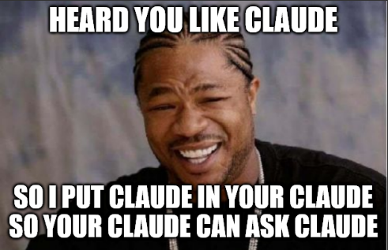

# claude-coach

**Prompt enrichment, adversarial stress-testing, live session advisor, and 112 curated tips for Claude Code.**

[](https://code.claude.com/docs/en/plugins)
[](tips.json)
[](https://github.com/kam-l/claude-coach/actions/workflows/test.yml)
[](https://github.com/kam-l/claude-coach/releases)
[](LICENSE)




- **Prompt enrichment** — classifies ambiguous prompts via Groq, steers Claude's first action automatically
- **Adversarial commands** — `/think` (Hegelian dialectic), `/verify`, `/challenge`, `/refine`
- **Sonnet advisor** — reads your transcript, injects session-specific coaching (⚠️ inject / ℹ️ display)
- **112 curated tips** — sourced from Boris Cherny + Anthropic team best practices
- **12 thinking lenses** — inversion, first-principles, pareto, second-order, and more

## Install

```bash
claude plugin marketplace add kam-l/claude-coach
claude plugin install claude-coach
```

**Prompt enrichment requires one of:**
- `GROQ_API_KEY` (free — [console.groq.com](https://console.groq.com)) — recommended
- `ANTHROPIC_API_KEY` (console.anthropic.com, per-token billing) — fallback

Set as system environment variables. Without either key, prompt enrichment is silently skipped and only spinner tips are active. The Sonnet advisor uses the `claude` CLI directly (your existing Pro/Max subscription) — no API key needed.

## Quick Start

```bash
# Inside Claude Code — guided setup
/claude-coach:init

# Restart Claude Code to load changes
```

## How It Works

### 🎯 Prompt enrichment (automatic)

Classifies ambiguous user prompts via Groq and routes Claude to the right workflow before it starts working:

```
User prompt → local gate → Groq classifier
                                │
                ┌───────┬───────┼───────┬────────┐
                ▼       ▼       ▼       ▼        ▼
             clarify  probe   recon   plan     none
                │       │       │       │
                ▼       ▼       ▼       ▼
          /question  /verify  Agent   EnterPlanMode
                       │     (Explore)
               ┌───────┼───────┐
               ▼       ▼       ▼
          /challenge /refine /think
```

| Directive | Routes to | When |
|-----------|----------|------|
| `clarify` | `/claude-coach:question` | Ambiguous scope, missing detail |
| `probe` | `/claude-coach:verify` | Unstated assumptions, opinions, trade-offs — auto-escalates to challenge, refine, or think |
| `recon` | Agent (Explore) | References unexamined code |
| `plan` | EnterPlanMode | Multi-file, 3+ subtasks, architecture |

The local gate skips trivial prompts (short commands, confirmations, slash commands) with zero latency. Only hedging, vague, multi-sentence, or broad-scope prompts reach the classifier (~250ms via Groq free tier).

Requires `GROQ_API_KEY` (free — [console.groq.com](https://console.groq.com)) or `ANTHROPIC_API_KEY` (fallback) as a system environment variable. Silently skips if neither is set.

### 🗡️ Adversarial commands

Five commands for structured decision-making and quality assurance:

| Command | What it does |
|---------|-------------|
| `/claude-coach:question` | Batch Q&A with choices — structured clarification |
| `/claude-coach:think` | Thesis/antithesis/synthesis dialectic — spawns attacker + defender agents |
| `/claude-coach:verify` | Auto-escalating verification — routes to challenge, refine, or think |
| `/claude-coach:challenge` | Single-pass adversarial stress-test |
| `/claude-coach:refine` | Iterative adversarial refinement loop (up to 5 rounds) |

### 💡 Spinner tips (always on, zero cost)

112 hand-curated tips (sourced from Boris Cherny + Anthropic team) rotate during tool calls. Passive reinforcement — you glance at them while waiting.

### ℹ️ Sonnet advisor (opt-in)

A detached Sonnet worker reads your session transcript and produces 1-3 tips grounded in what you're actually doing:

```
ℹ️ Run tests before committing the auth middleware changes
ℹ️ Use /fix — methodical debugging beats trial and error here
ℹ️ The retry logic in api.js needs a backoff — ask Claude to add one
```

When the advisor has *strong* advice, it's injected directly into Claude's context via `additionalContext`. Claude acts on the coaching without you having to relay it.

## Bundled Agents

| Agent | Role |
|-------|------|
| `adversary` | Universal stress-tester — finds concrete problems with quality + analytical lenses |
| `attacker` | Antithesis advocate — builds the case AGAINST a claim (used by `/think`) |
| `defender` | Thesis advocate — builds the case FOR a claim (used by `/think`) |

## Thinking Lenses

12 analytical frameworks available via the `structured-thinking` skill:

`inversion` · `first-principles` · `second-order` · `5-whys` · `pareto` · `via-negativa` · `opportunity-cost` · `occams-razor` · `10-10-10` · `eisenhower-matrix` · `swot` · `one-thing`

Based on [taches-cc-resources/commands/consider](https://github.com/glittercowboy/taches-cc-resources/tree/main/commands/consider) by Lex Christopherson (MIT). Used automatically by the adversary agent when analyzing decisions and assumptions.

## Configuration

```json
// ~/.claude/settings.json
{
  "env": {
    "CLAUDE_COACH": "1",
    "CLAUDE_COACH_INTERVAL": "300"
  }
}
```

| Variable | Default | Description |
|----------|---------|-------------|
| `CLAUDE_COACH` | `0` | Enable Sonnet advisor + hook injection |
| `CLAUDE_COACH_INTERVAL` | `900` | Seconds between advisor cycles |
| `CLAUDE_COACH_COSTS` | `0` | Show advisor cost in statusline (`[$0.05]`) |
| `GROQ_API_KEY` | — | Prompt enrichment via Groq (free tier, ~250ms) |
| `ANTHROPIC_API_KEY` | — | Prompt enrichment fallback via Haiku (~$1/month) |

Set API keys as **system environment variables**, not in settings.json.

**Advisor cost:** ~$0.10-0.18/cycle. Pro/Max users spend rate-limit budget, not dollars.
**Enrichment cost:** Free with Groq. ~$0.001/day with Anthropic Haiku.

Or run `/claude-coach:init` for guided setup.

## Tip Categories

| Category | # | Examples |
|----------|---|---------|
| Workflow | 23 | Plan mode, `/rewind`, fan-out, "paste bug say fix", /loop, parallel worktrees |
| Context | 20 | 200-line limit, `/compact` at 50%, "Update CLAUDE.md so you don't repeat this" |
| Agents | 18 | Test time compute, "say use subagents", pipeline gates, fan-out scoping |
| Hooks | 11 | `exit 2` feedback, route permissions to Opus, Stop hook to nudge |
| Quality | 22 | "Grill me — no PR until I pass", prototype > PRD, Explanatory output style |
| Performance | 18 | `/sandbox` (84% fewer prompts), voice dictation, Opus with thinking |

## All Commands

| Command | What it does |
|---------|-------------|
| `/claude-coach:init` | Full setup — spinner tips + setup mining + statusline + advisor |
| `/claude-coach:tips` | List, add, or refresh tips (curated + project-specific) |
| `/claude-coach:uninstall` | Remove all traces |
| `/claude-coach:question` | Batch Q&A with choices |
| `/claude-coach:think` | Thesis/antithesis/synthesis dialectic |
| `/claude-coach:verify` | Auto-escalating adversarial verification |
| `/claude-coach:challenge` | Single-pass adversarial stress-test |
| `/claude-coach:refine` | Iterative adversarial refinement loop |

## Sources

- [Boris Cherny's tips](https://github.com/shanraisshan/claude-code-best-practice) — community-curated best practices from the creator of Claude Code + team (primary source for tips)
- [taches-cc-resources](https://github.com/glittercowboy/taches-cc-resources) by Lex Christopherson — 12 thinking lenses (MIT)
- [Anthropic Claude Code docs](https://code.claude.com/docs/en/best-practices)

## License

MIT
