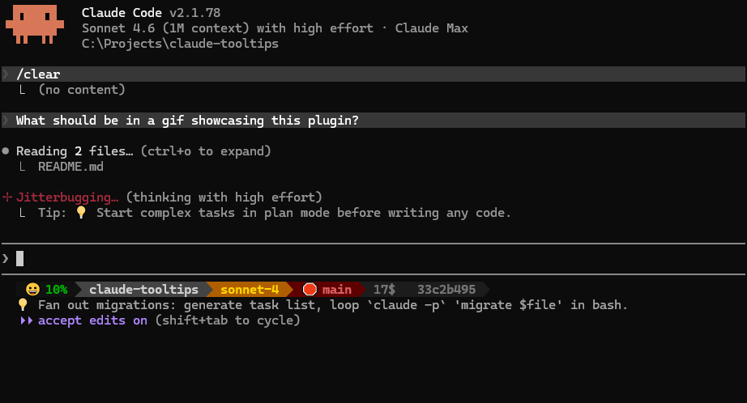

# claude-coach

**Session-aware coaching for Claude Code — curated tips, live Sonnet advisor, and context injection.**

[](https://code.claude.com/docs/en/plugins)
[](LICENSE)
[](https://nodejs.org)



- **69 curated tips** — workflow, context, agents, hooks, quality, performance
- **Sonnet advisor** — analyzes your transcript, coaches in real-time
- **Hook injection** — strong advice injected directly into Claude's context
- **Setup mining** — Sonnet pre-mines your toolchain into a coaching reference
- **Zero-cost fallback** — tips rotate in the spinner with no LLM calls when advisor is off

## Install

```bash
claude plugin marketplace add kam-l/claude-coach
claude plugin install claude-coach
```

<details>
<summary>Alternative: npm</summary>

```bash
npm install -g @kam-l/claude-coach
```
</details>

## Quick Start

```bash
# Inside Claude Code — guided setup
/claude-coach:tips init

# Restart Claude Code to load changes
```

## Three Delivery Modes

### 💡 Spinner tips (always on, zero cost)

69 hand-curated tips rotate during tool calls. Passive reinforcement — you glance at them while waiting.

### ℹ️ Sonnet advisor (opt-in)

A detached Sonnet worker reads your session transcript and produces 1-3 tips grounded in what you're actually doing:

```
ℹ️ Run tests before committing the auth middleware changes
ℹ️ Use /fix — methodical debugging beats trial and error here
ℹ️ The retry logic in api.js needs a backoff — ask Claude to add one
```

The advisor knows your setup — it reads a pre-mined coaching reference containing your commands, skills, hooks, friction patterns, and the full tip library. It surfaces the *right* existing tip when the session matches, or generates a new one when none fit.

### ⚠️ Hook injection (automatic)

When the advisor has *strong* advice, it's injected directly into Claude's context via `UserPromptSubmit` → `additionalContext`. Claude acts on the coaching without you having to relay it. The advice is consumed once and deleted — no repeats.

```
[Session Coach]
⚠️ Gate each pipeline step — the reviewer agent has no verification gate
```

## Configuration

```json
// ~/.claude/settings.json
{
  "env": {
    "CLAUDE_COACH": "1",
    "CLAUDE_COACH_INTERVAL": "300"
  }
}
```

| Variable | Default | Description |
|----------|---------|-------------|
| `CLAUDE_COACH` | `0` | Enable Sonnet advisor + hook injection |
| `CLAUDE_COACH_INTERVAL` | `900` | Seconds between advisor cycles |

**Cost:** ~$0.10-0.18/cycle. Pro/Max users spend rate-limit budget, not dollars.

Or run `/claude-coach:tips init` for guided setup.

## Tip Categories

| Category | # | Examples |
|----------|---|---------|
| Workflow | 11 | Plan mode first, `/rewind` for off-track runs, fan-out with `claude -p` |
| Context | 11 | 200-line CLAUDE.md limit, `/compact` at 50%, `.claudeignore` |
| Agents | 16 | Generator/evaluator separation, pipeline gates, fan-out scoping |
| Hooks | 9 | `exit 2` feedback, `statusMessage`, `async: true` for slow hooks |
| Quality | 13 | Spec-driven review, explain-back, ultrathink, contrastive examples |
| Performance | 9 | `/model` downgrade, `effortLevel`, worktree parallelism |

## Commands

| Command | What it does |
|---------|-------------|
| `/claude-coach:tips init` | Full setup — spinner tips + setup mining + statusline + advisor |
| `/claude-coach:tips refresh` | Re-apply tips, re-mine setup context, update runtime |
| `/claude-coach:tips add <tip>` | Add a custom tip |
| `/claude-coach:tips list` | Print all tips by category |
| `/claude-coach:tips advisor` | Configure the Sonnet session advisor |
| `/claude-coach:tips uninstall` | Remove all traces |

## Sources

- [Anthropic Claude Code docs](https://code.claude.com/docs/en/best-practices)

## License

MIT
